# Change Management Lab – ServiceNow ITSM

## Scenario
A Normal Change request was created to increase VPN session timeout in order to reduce frequent remote user disconnections and improve remote user stability.

---

## Actions Performed
- Created a Normal Change request
- Completed summary, scope, and justification fields
- Assessed risk and impact
- Submitted and received approval
- Scheduled a maintenance window
- Created Planning, Implementation, and Testing tasks
- Executed configuration update
- Performed post-implementation validation
- Closed all related change tasks
- Successfully closed the change request

---

## Skills Demonstrated
- ServiceNow Change Management
- ITIL Change Lifecycle
- Risk & Impact Assessment
- Change Approval Workflow
- Change Scheduling & Conflict Detection
- Task Execution & Monitoring
- Change Closure Documentation

---

## Tools Used
- ServiceNow PDI
- IT Service Management (ITSM)
- Service Operations Workspace

---

# Change Lifecycle Screenshots

---

## 1️⃣ Change Created

---

## 2️⃣ Summary & Scope Completed
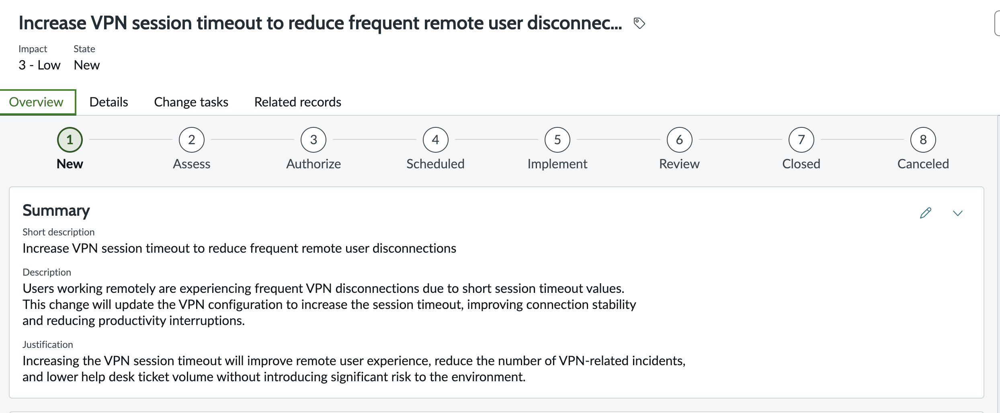
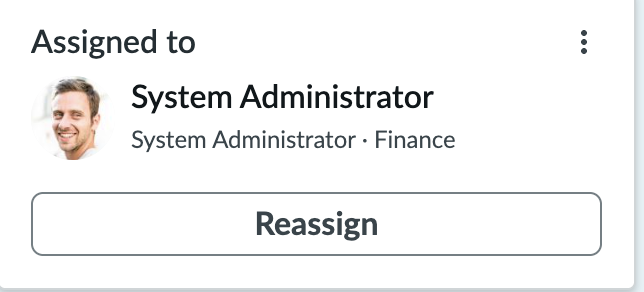

---

## 3️⃣ Planning Phase
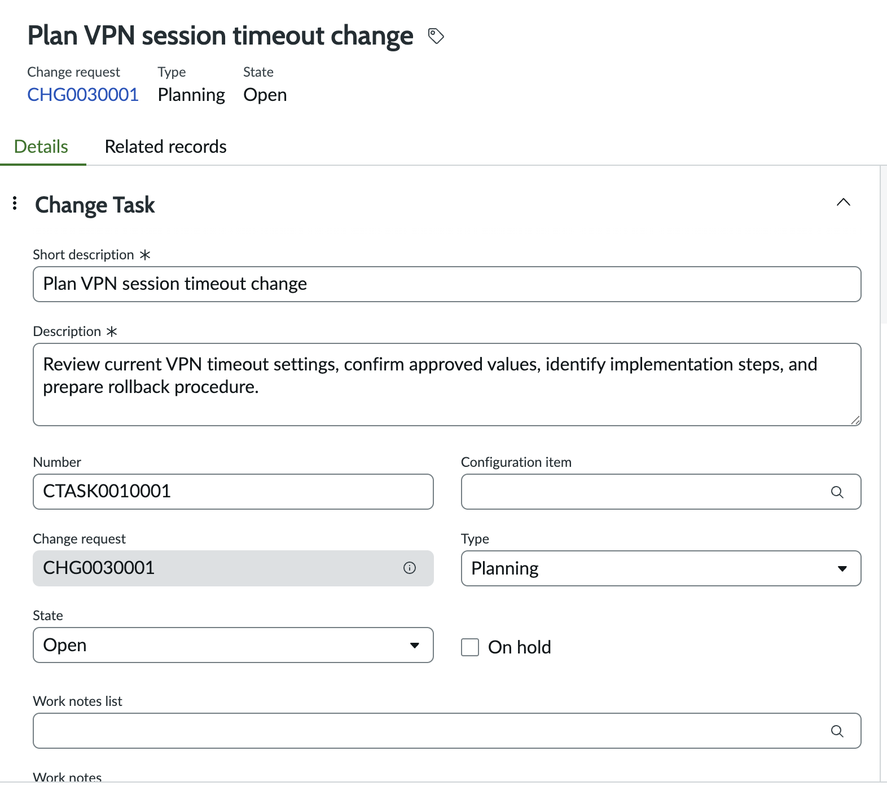
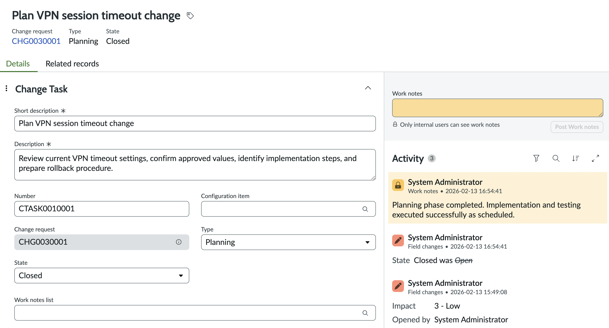

---

## 4️⃣ Scheduling & Conflict Check
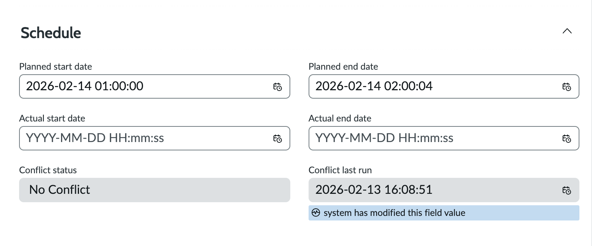
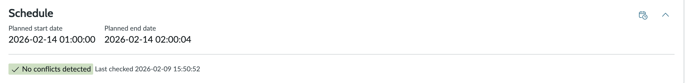

---

## 5️⃣ Implementation Phase
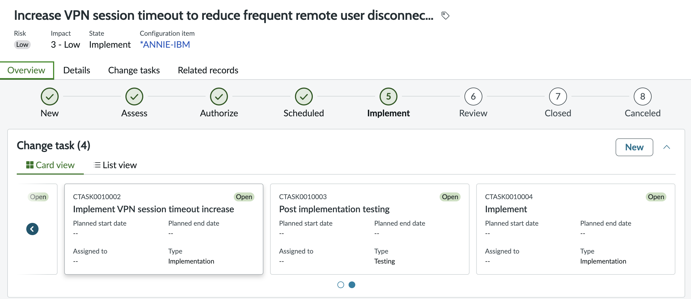
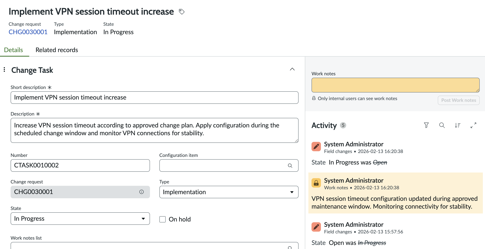
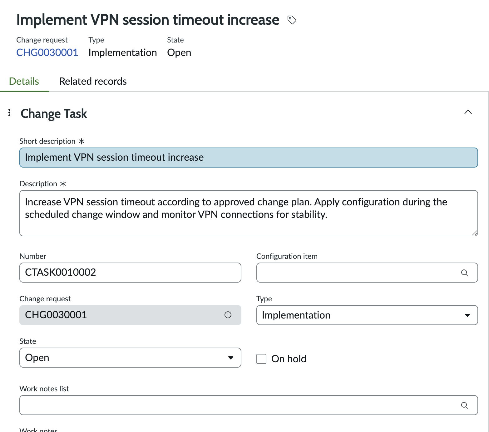
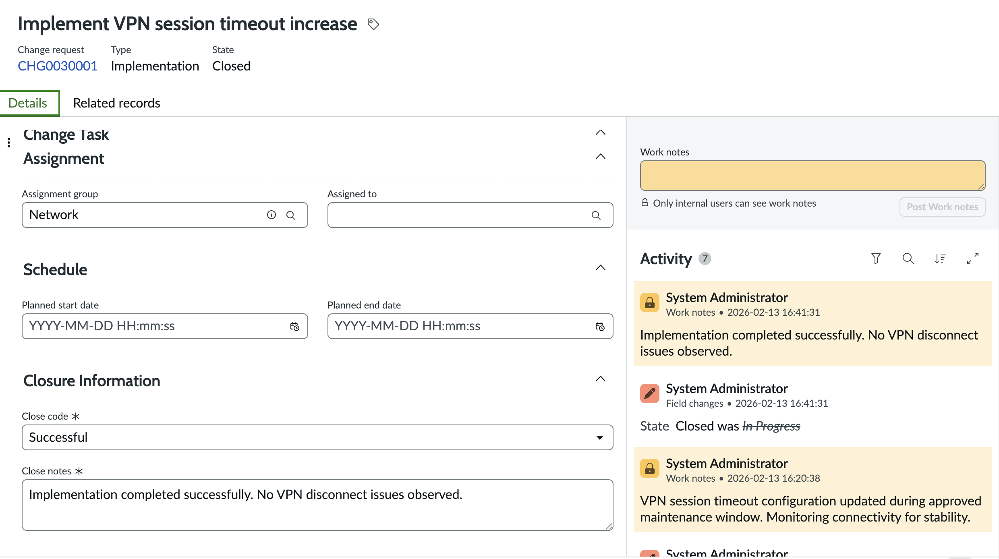

---

## 6️⃣ Post-Implementation Testing
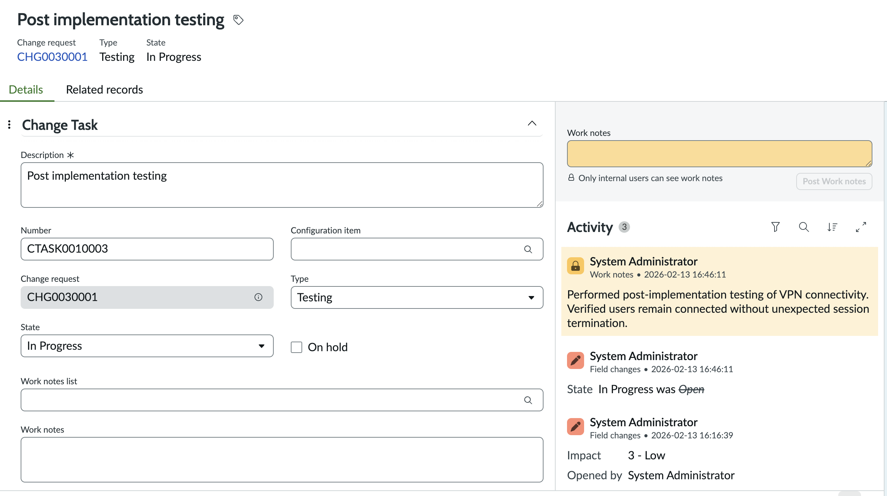
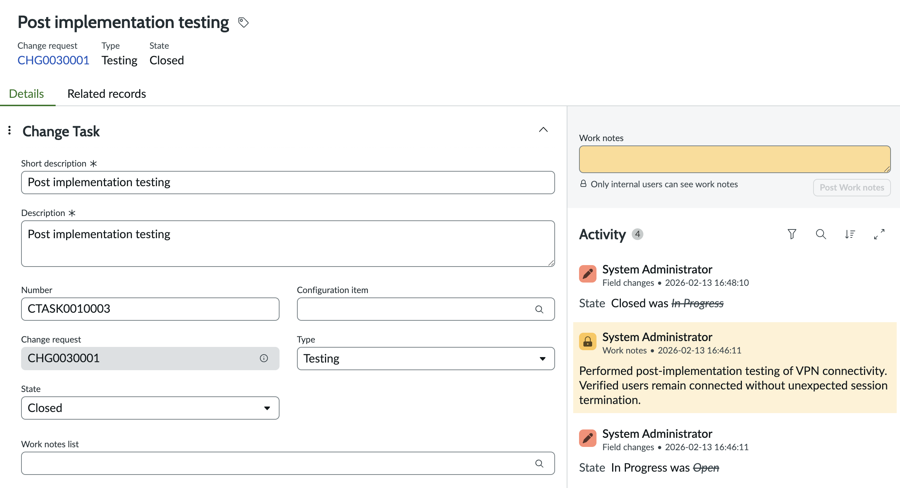

---

## 7️⃣ Assignment & Execution View

---

## 8️⃣ Change Successfully Closed

---

## Result
The VPN session timeout was successfully increased during the approved maintenance window.  
No connectivity issues were reported.  
All change tasks were completed and validated successfully.  
No rollback was required.

---

## Author
Abdulaziz
