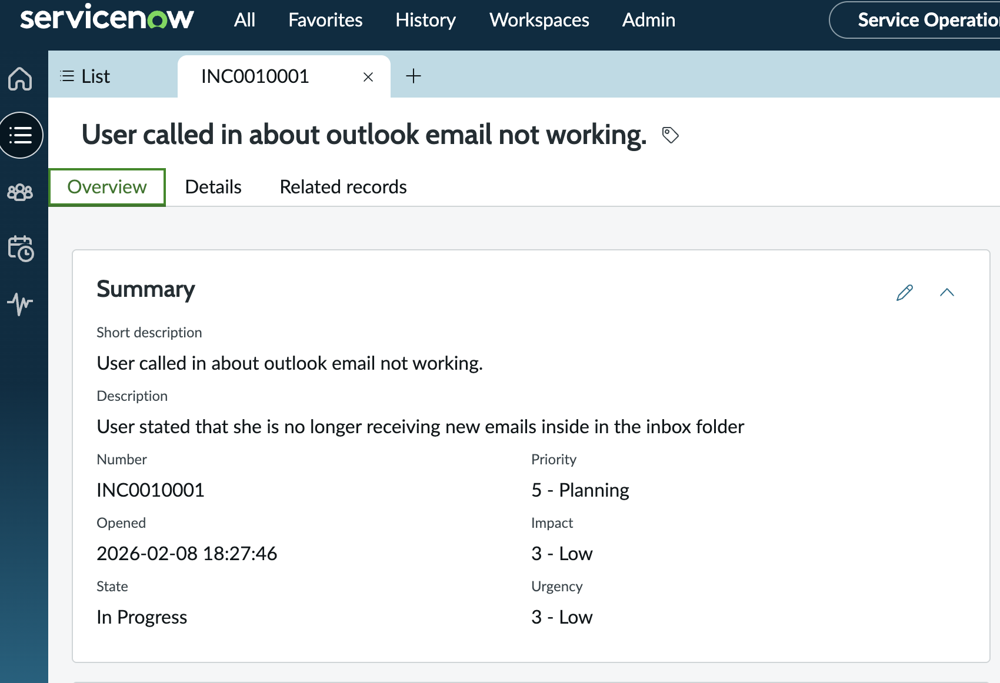
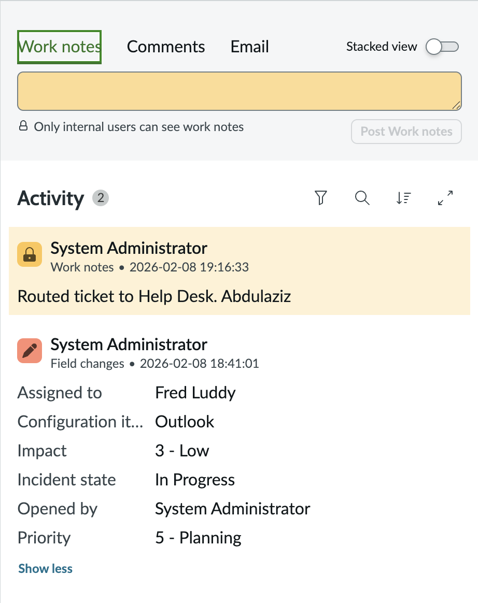
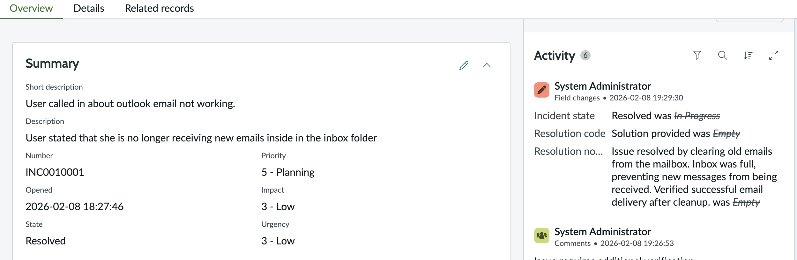

# Incident Management Lab – ServiceNow ITSM

## Scenario
User reports an IT issue that requires immediate support.

## Actions Performed
- Created an Incident ticket
- Categorized the issue correctly
- Set impact and urgency
- Assigned the incident to the appropriate group
- Updated the incident state through resolution

## Skills Demonstrated
- ServiceNow Incident Management
- ITSM workflows
- Priority calculation (Impact × Urgency)
- Service Operations Workspace

## Tools Used
- ServiceNow PDI
- IT Service Management (ITSM)

## Incident Lifecycle Screenshots

### Incident Created

### Incident Assigned

### Incident Resolved

