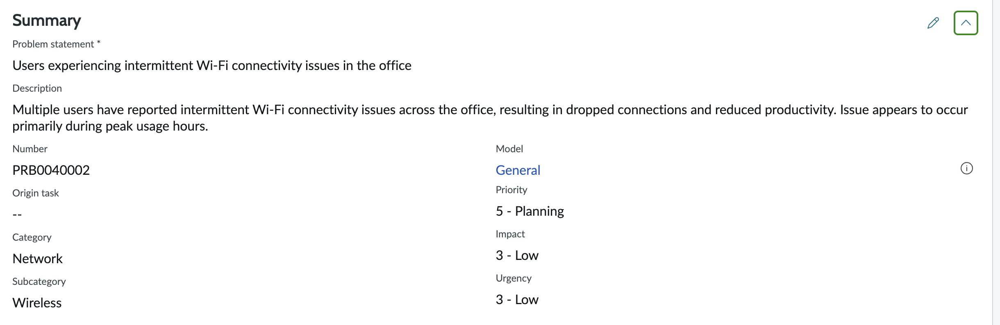
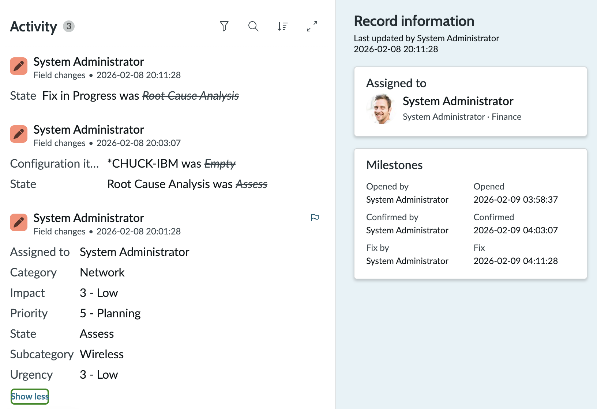
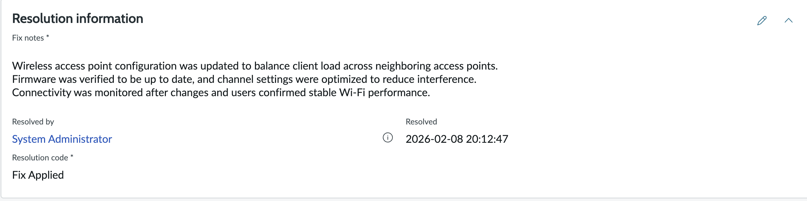

# Problem Management Lab – ServiceNow ITSM

## Scenario
Multiple users reported intermittent Wi-Fi connectivity issues in the office.
Several related incidents were identified, indicating a recurring underlying issue.

---

## Actions Performed
- Created a Problem record from related incidents
- Categorized the problem under Network > Wireless
- Set impact, urgency, and priority appropriately
- Performed Root Cause Analysis (RCA)
- Documented workaround and cause notes
- Created problem and fix tasks
- Updated the problem state through the lifecycle
- Documented resolution details

---

## Root Cause Analysis

### Workaround
Users were temporarily advised to reconnect to the network or switch to an alternative access point to restore connectivity.

### Root Cause
Root cause identified as intermittent wireless access point signal degradation due to outdated firmware on network devices.

---

## Resolution
- Scheduled firmware updates for affected access points
- Monitored network performance post-update
- Verified stable Wi-Fi connectivity across impacted areas
- Confirmed no further related incidents were reported

---

## 📸 Evidence – Problem Management Lifecycle

### Problem Created

### Root Cause Analysis

### Problem Resolved

---

## Skills Demonstrated
- ITIL Problem Management
- Root Cause Analysis (RCA)
- Known Error identification
- ServiceNow Problem & Fix Tasks
- Documentation and evidence tracking

---

## Tools Used
- ServiceNow PDI
- IT Service Management (ITSM)
- Service Operations Workspace
